# Лабораторная работа 5

> Горбунов Миша, КН-401

## Условие

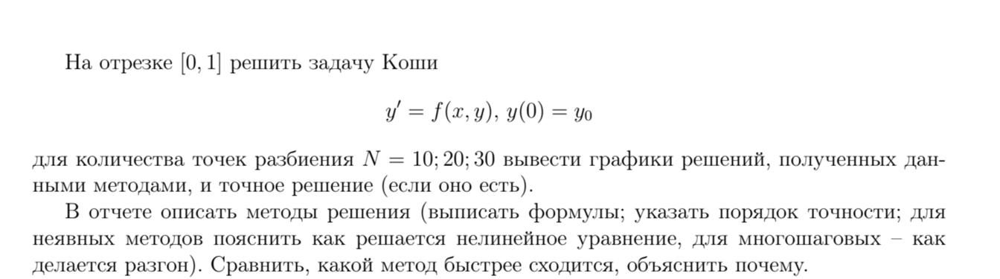

## Вариант 20

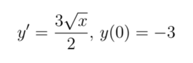

- Метод Эйлера Явный
- Тейлора третьего порядка
- Трапеций (Неявный метод Адамса 2-го порядка)

# Точное решение:

### Формула

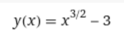

В дальнейшем будем сравнивать получившиеся приближенные решения с точным.

# Приближенные решения

## Метод Эйлера Явный

### Формула

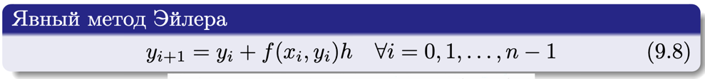

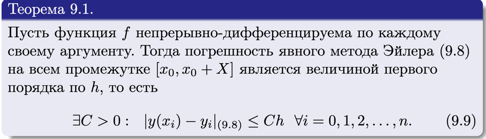

Погрешность явного метода Эйлера на всём промежутке является величиной первого порядка = O(h)

## Метод Тейлора 3-го порядка

### Формула

Привожу сразу же упрощенную формулу для функций f, не зависящих от y

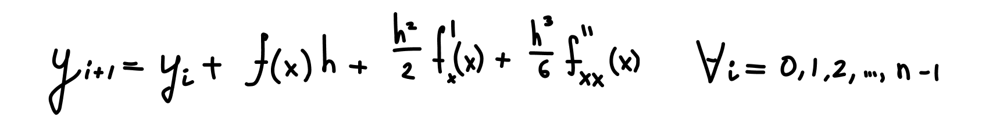

Для вычислений нужно найти f' и f'':

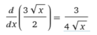

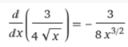

Погрешность метода на промежутке = O(h^3)

## Неявный метод Адамса 2-го порядка

### Формула

Формула для неявного метода Адамса 2-го порядка выглядит так:

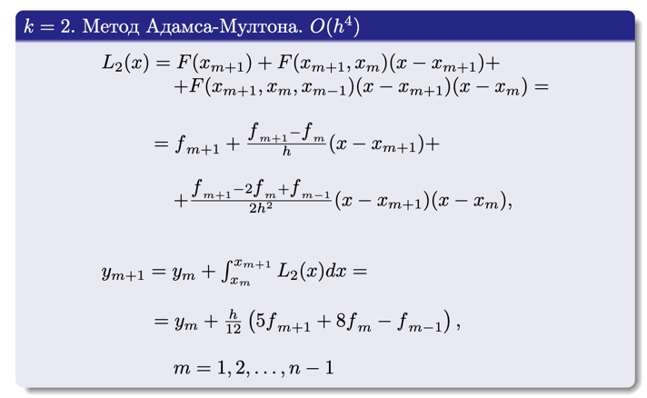

В качестве разгона будем использовать метод Рунге-Кутты 4-го порядка

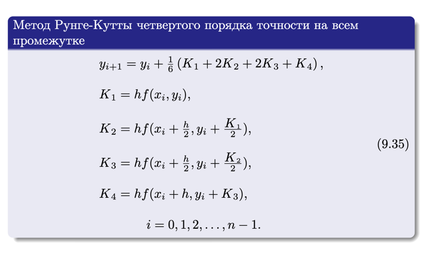

Исходная функция не зависит от y. Значит мы можем выразить y_i+1:

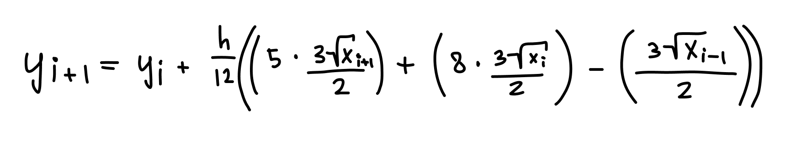

Погрешность метода на промежутке: O(h^3)

## Сравнение точности:

### N = 10
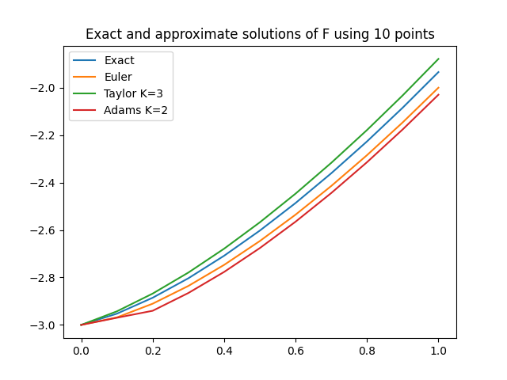

### N = 20
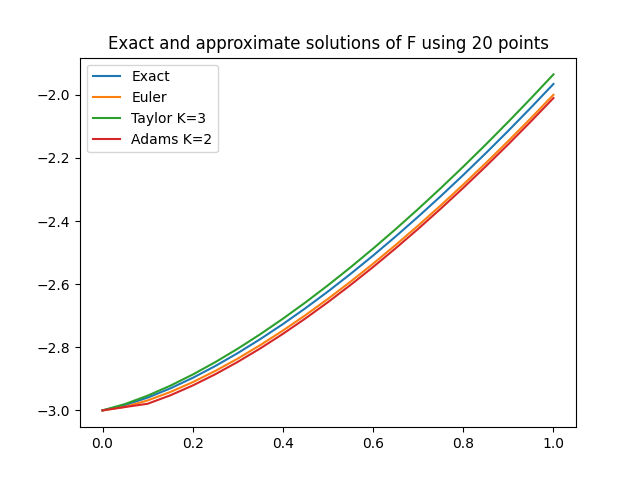

### N = 30
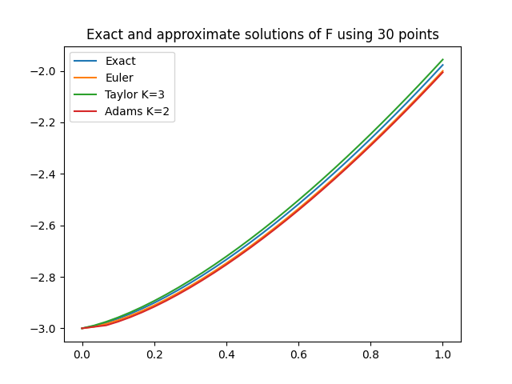

> Сходится хуже всего метод Эйлера. Его погрешность на промежутке O(h), у других методов - O(h^3)